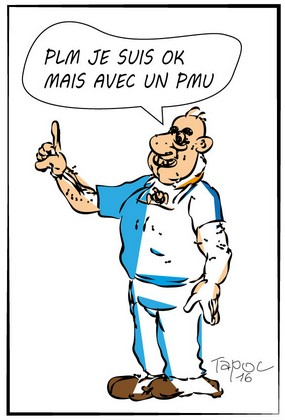

Double jeu à la mairie
======================

A Melahan, les habitants zinzin demandent toujours plus de concertation !
De quoi je me mêle ? Ils exagèrent, ils n'avaient qu'à voter ! Zut, on me
dit qu'ils l'ont dèja fait. Mmm. Mmm.

De quoi je me mêle ! Du coup je m'enmêle.

Bon, bref, pour la concertation, heureusement on a un truc. La mairierie et
le propromoteur ont décidé de jouer, à deux, un double jeu : à PLM ils ont
bien balladé les habitants zinzin dans la prairie. C'etait super bien
et super rigolo !

Et le jeu a duré deux heures. Bien joué pour un double jeu !

Les habitants ont posé des questions. Mais n'ont pas eu de réponse. Bon,
ca fait partie du jeu. Ils iront en deuxième session de la deuxième session.

    2 pour la mairierie et le propromoteur, 1 pour les habitants zinzin.

..  attention::

    Un lecteur attentif de carpentras, nous fait remarquer que c'est en fait
    un triple jeu : Mairierie + Metrotro + Propromoteur. Si l'habitant joueur
    rèvait d'un "triplé", il peut toujours attendre sont PMU. En attendant le
    PLU il n'a qu'a se gratter.

Bilan final: **3 / 1  : les élus lulus et tous nos copains, on mène haut les mains !**

