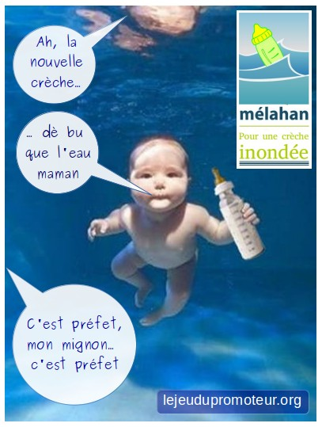

Bébé nageur
===========

Dernière minute. La mairie de Melahan semble enfin avoir décidé de déplacer
la crèche des "bu que l'eau", du terrain des "sources", vers un terrain
en zone innondable. Objectif: avoir l'eau gratuite.
Ca coule de source, non ?

    Bébé nageur à la crèche : "j'ai bu que l'eau"

Il n'y a plus qu'a espérer que ce projet bateau ne tombe pas à l'eau.