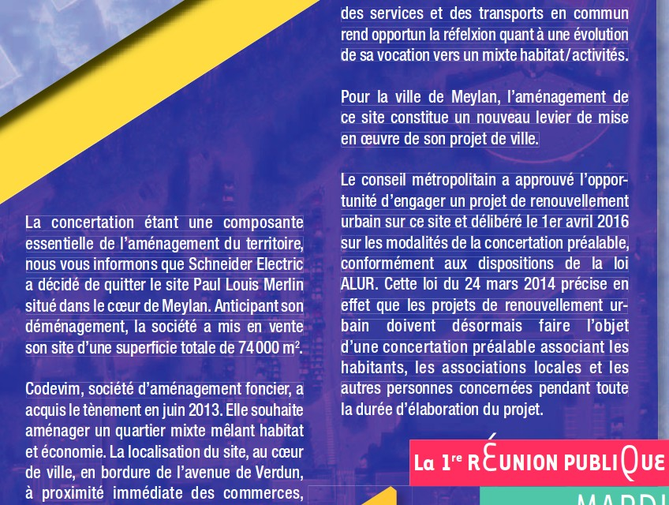
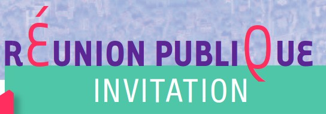
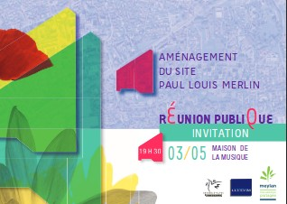
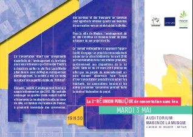

Quel carton !
=============

La Mairie de la ville modèle a envoyé un magnifique `carton d'invitation`_ pour la réunion du 03 Mai 2016.

============== ==============
    Recto          Verso
============== ==============
   |recto|         |verso|
============== ==============

**26 avril 2016, 14:14**. Un habitant-grognon-et-vieux-con nous à laissé le message suivant ::

    C'est qui qui a rédigé le torchon d'invitation pour le 3 Mai?
    Erreurs de frappes, caractères majuscules sans raison...
    C'était mieux avant comme disent les personnes d'un certain âge
    (serais je en train de devenir un vieux con?)

Zut alors, Monsieur grognon mélange les torchons et les cartons d'invitations :-(
Quoi qu'il en soit, la question est posée :
** mais qui-donc a bien pu faire ce carton/torchon et qu'avait il dans la tête à ce moment là** ?

Aide la rédaction du jeudupromoteur a résoudre cette énigme douteuse.

Q1. Erreur de frappe
''''''''''''''''''''

Tout d'abord cherche les ``erreurs de frappe`` dans le carton.

..  admonition:: Réponse
    :class: toggle

    Visiblement l'auteur avait la ré**FEL**xion mal placée. Il devait
    penser à autre chose quand il a écrit tout cela.

Q2. Caractères majusCULes
'''''''''''''''''''''''''

Devine à quoi pensait l'auteur du carton pour faire ces
``caratères majusCULes sans raison``.

..  admonition:: Réponse
    :class: toggle

    A quoi pensait-il ? Difficle à dire. On voit bien un joli Q, comme un O mais
    avec une petite queue. Mais alors à quoi correspond cette joile paire de E
    (regarde bien, il y a deux E, les deux avec un galbe superbe) ? Et à quoi correspond
    ce bel accent montant ? Difficile à dire ! Demandes à tes parents. Envoie nous
    tes dessins, on les publira (dans un magazine spécialisé).

Q3. Qui l'a fait
''''''''''''''''

Devine qui a fait un tel carton.

..  admonition:: Réponse
    :class: toggle

    Un habitant zinzin de sessins, nous indique que l'artiste est peut être
    l'auteur du `célébre logo du CNRS`_. Il ne s'agit que de rumeur mais c'est bien
    possible. L'artiste avait déjà un problème de **réfelaxion**. Il suffit
    de **regarder ce logo dans un miroir**, et tu veras qu'il pensait déjà
    à la même chose. Son signe, le petit truc en plus qui rentre dedans.

    ..  figure:: images/logo-cnrs.jpg
        :align: center

        Logo du CNRS. Un exemple de réfelaxion très poussé.

..  _`carton d'invitation`:
    http://www.meylan.fr/uploads/Document/a0/WEB_CHEMIN_16686_1461582271.pdf

..  _`célébre logo du CNRS`:
    http://www.cnrs.fr/compratique/savoir/logos.htm

