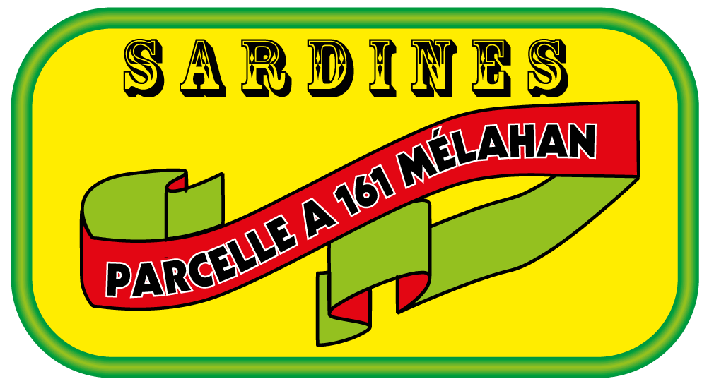

Comme des sardines
==================

Après un réunion de concertation Mr grospif est allé à la mairie de melahan pour
procurer les plans de la parcelle 161 de la crèche.
On lui a donné ca :

    90 logements sur la parcelle AL 161. Pro-promotion de la mairie.

Bon, au service urbanisme on l'a encore mené en bateau et mis en boite.
Pauvre monsieur Gros Pif. Coté liquide,
:ref:`lui il préfère le scotch <scotch-a-07>`. Les huiles de Melahan
le savent et l'on roulé dans la farine. Elles auraient pu le griller,
c'est bon, mais ca pue, les sardines grillèes. Ah ces grandes huiles...

Y'en a qui disent que ces projets immobiliers à la source, c'est des histoires de liquide.
Et que la parcelle de la crêche correspond en fait d'une "queue de projet" planifié par
les anciennes huiles de melahan... Bref, des histoires incompréhensibles et
qui finalement se termineront juste en queue de poisson, comme tout a melahan.
Alors un conseil, écoute pas toutes les conneries qui sont dites ou écrites...

