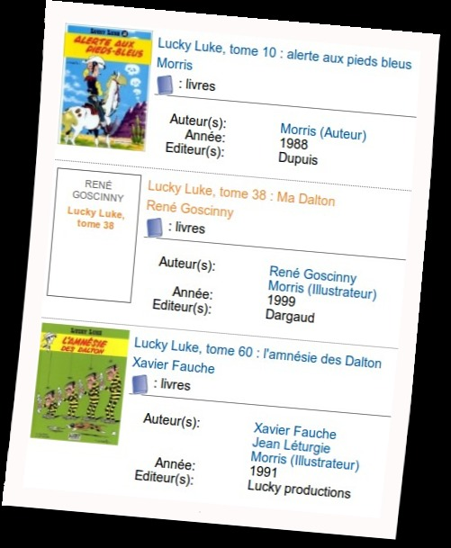

..  _`MaDalton`:

La face cachée de Ma' Dalton
============================

Sauras tu trouver la face cachée de Ma' Dalton ?

Certainement pas ! A Melahan, anciennement "Dalton City", tout est a été discrètement effacé
de son passage. Ou peut être caché sous le tapis. Ou ailleurs. Nous on sait pas (et on s'en moque).

En tout cas gràce à Luky Luke l'opération vague propre semble s'être répandue de la Mairie
jusqu'aux Bibilothèques de la ville ! Le portait de Ma' Dalton a été arraché partout et personne
ne sais pourquoi. Parole du Luky Luke, on n'a jamais vu ca ! Trop rigolo.

    La face cachée et arrachée de Ma' Dalton

Si tu nous crois pas `va voir toi même la liste des luky luke`_. C'est sur la `deuxième page`_.

**Alors, tu nous crois maintenant ?** Il se passe vraiment de drôle de truc à Melahan.
Mais chuut !!! Il faut pas que ca se sache.

Maintenant la question qui se pose est "mais qui c'est qu'a fait ça !". C'est pas nous on le jure !
:ref:`Affaire à suivre <AdeptesMADalton>` ...

..  _`va voir toi même la liste des luky luke`:
    http://www.meylan-bibliotheque.fr/recherche/simple/expressionRecherche/lucky+luke/

..  _`deuxième page`:
    http://www.meylan-bibliotheque.fr/recherche/simple/expressionRecherche/lucky+luke/tri/*/page/2

