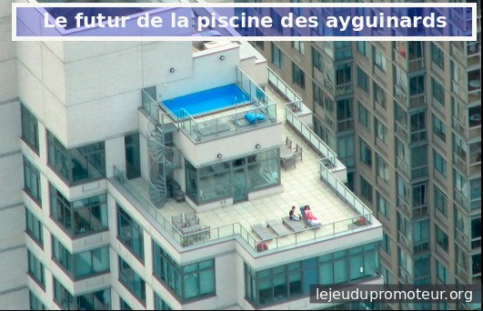

Le conpromis des ayguinards
===========================

Après de multiples péripathétities (bref c'est super compliqué, les habitants comprennent pas
tous ce qui leur arrive et on même eu l'impression de se faire manipuler...),
enfin un conpromis pour le futur de la piscine des ayguinards à Melahan !

Il y aura bien des logements sur ce terrain, parole de pro-pro-moteur, mais pour
faire le jeu de la concertation, il y aura une piscine aussi.

Elle sera certes un peu plus petite, mais l'avantage au moins, c'est qu'elle sera privée.
Et pour rigoler l'architecte l'a faite juste à l'altitude de Meylan-le-haut. Bien joué non ?

    La piscine de bubulle aux ayguinards

Que demande le peuple ? On sait pas trop. Un habitant a dit "Melahan haut" lors d'une
réunion de concertation. Le pro-pro-moteur et les élus lulus on pensé qu'il s'agissait de la
piscine. Voila, c'est (bientôt) fait.

Comme quoi le projet initial n'est pas tombé à l'eau. En attendant que la métro soit prête,
on va faire des jardins et des trucs rigolos pour faire patienter les habitants zinzins et
`faire plaisir aux écolos lolos`_.

Le pro-pro-moteur peut bien attendre un (petit) peu. Y'a plein d'autres projets avec les élus lulus
pour alors il peut bien patienter un peu. Et la métro aussi.

..  _`faire plaisir aux écolos lolos`:
    http://www.lesvertsdemeylan.asso.fr/site/?p=3933