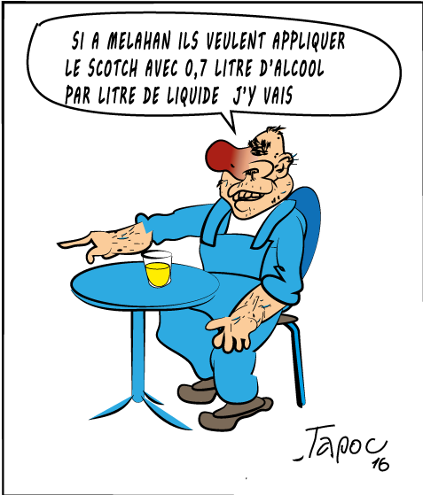

..  _`scotch-a-07`:

Le scotch à 0.7
===============

Paraît que ch'est le taux d'ensité recommandé par l'scotch, c'est 0.7 sur
la parcelle d'la crèche. C'est l'monsieur de "new deal", qui l'a dit !
Quel deal, l'était encor chouthé celui'la ! Parôle de gro pif.

    Mr gros pif au bar de mélahan, après la réunion de concertation
