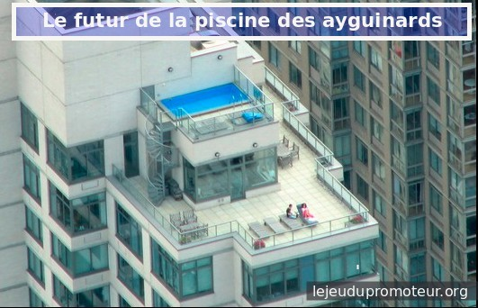
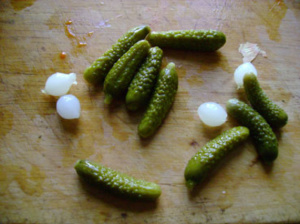

Les con-promis des ayguinards
=============================

Après de multiples péripathétities [#f1]_, enfin le temps des con-promis pour la piscine des
ayguinards à Melahan !

Finalement il y aura bien des logements sur ce terrain, parole de pro-promoteur,
mais pour faire le jeu de la con-certation, il y aura une piscine aussi !

La piscine sera certes un peu plus petite, mais l'avantage au moins, c'est qu'elle sera privée.
Et pour rigoler l'architecte l'a faite juste à l'altitude de Meylan-le-haut. Bien joué non ?

    La piscine de bubulle aux ayguinards

Que demande le peuple ? On sait pas trop. Un habitant a dit "Melahan haut" lors d'une
réunion de concertation. Le pro-pro-moteur et les élus lulus on pensé qu'il s'agissait de la
piscine. Voila, c'est (bientôt) fait.

Comme quoi le projet initial n'est pas tombé à l'eau...

**En attendant ...**

En attendant que la métro soit prête, on va faire des jardins,
planter des oignons et des cornichons. Car les oignons et les cornichons
c'est vraiment trop bon (voit le débat [#f2]_) !

Des trucs rigolos pour faire patienter les habitants zinzins quoi.
Et pour `faire plaisir aux écolos lolos`_.

Le pro-promoteur a le temps. Et peut bien attendre un peu.
Après, quelques années il pourra construire plus eau.

Dans quelques années, quand le pro-promoteur réclamera son dû,
personne ne pourra dire sérieusement que couper des plans d'oignons et
de cornichons pose un gros problème. Il y aura toujours certains habitants gnangnans
encore prêt à pleurer si on coupe les oignons, mais bon...

Finalement des petits oignons et des cornichons pour attendre un peu c'est bien.
De toute façon le pro-promoteur a plein d'autres projets avec les élus lulus.
Et avec la métro aussi. Alors attendre un peu ...

..  [#f1] C'est super compliqué, les habitants gnangnans comprennent pas tout ce qui
    leur arrive et on même eu l'impression de se faire manipuler et de se faire
    "baiser" en long et en larege et sur toute la longueur...

..  _`faire plaisir aux écolos lolos`:
    http://www.lesvertsdemeylan.asso.fr/site/?p=3933

..  _`grand débat`:
    http://cornichon-paradise.over-blog.com/d%C3%A9bat-pourquoi-des-oignons-avec-les-cornichons

..  [#f2] Un lecteur attentif de Carpentras nous a interpellé :
    "pourquoi des oignons avec les cornichons ?". C'est une très bonne question !
    Cette question a donné lieu à un `grand débat`_ sur le site
    `le paradis du cornichon`_ .

..  _`le paradis du cornichon`:
    http://cornichon-paradise.over-blog.com

