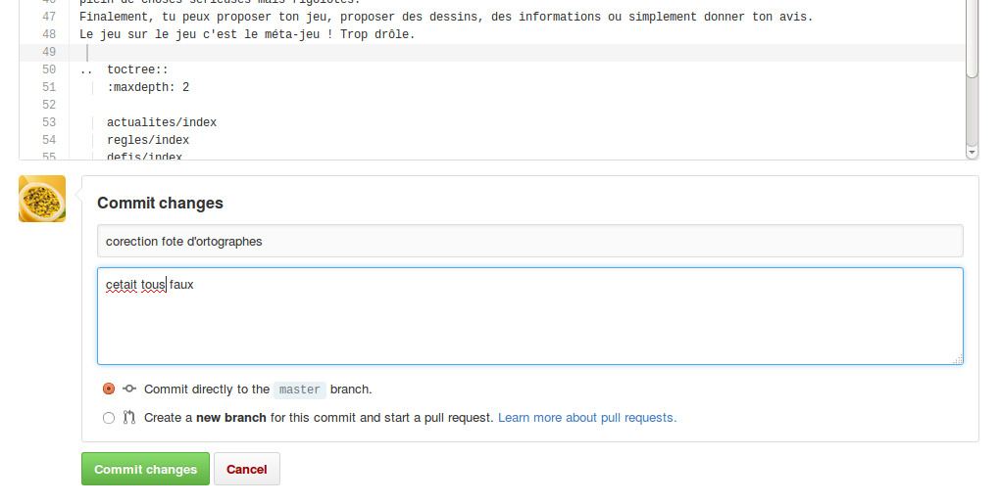

Modifications
-------------

..  note::

    Cette section suppose que tu es connect(é) à GitHub. C'est le cas si tu as suivi
    l'étape "connexion".

Pour proposer la modification d'une page il suffit de se trouver sur la page
à modifier et de cliquer sur le bouton de modification |Pencil|.
(regarde sur cette page, le bouton est toujours en haut à droite).
L'éditeur GitHub s'ouvrira avec le "texte source" de la page.

..  attention::

    Un éditeur "GitHub" s'ouvrira dans une nouvelle page ou nouvel onglet.
    **Une fois la modification faite ferme cet onglet pour revenir au site web normal**.

.. ........................................

    Le résultat devrait ressembler à cela :

    ..  figure:: images/GitHubSource.png
        :align: center

        Fenêtre de contrôle GitHub pour à la page à modifier.

    ..  note::

        L'icone en haut à droite montre que tu es connecté(e) à GitHub. Sinon c'est qu'il y a eu une
        erreur dans l'étape de connexion. contacte nous.

    **La seule chose importante pour toi dans cette page** est le petit crayon |Pencil| à droite,
    juste après``Raw | Blame | History``.

A n'importe quel moment cliquer sur le petit crayon |Pencil| te permetteras d'éditer le texte source
de la page sur laquelle tu te trouves. Par exemple dans l'écran ci-dessous monteur l'éditeur
de GitHub pour la page principale de ce site :

..  figure:: images/GitHubEditer.png
    :align: center

    Editeur contenant le "texte source" de la page à modifier.

Il suffit d'éditer le texte comme avec un texte normal. Il y a des drôles de symboles, mais
ne t'en préoccupes pas. Ne t'inquiête pas de la mise en forme. Un autre contribuable s'en chargera.

Une fois tes modifications faites, va en bas de la page.

    Enregistrement/annulation des modifications

Si tu veux faire au plus simple, il suffit de cliquer sur :

* "Commit changes" pour sauvegarder,
* "Cancel" pour annuler tes modifications.

Tu peux éventuellement mettre quelques mots sur le sens de la contribution. Pas la peine
de rentrer dans le détail car GitHub permet d'afficher toute les modifications ligne par
ligne si nécessaire.

Une fois la modification faite (ou pas) ferme la fenêtre github pour revenir à la page sur le site web.
**Ne sois pas surpris si tu ne vois pas tes modifications sur le site**. Tes modifications seront
revues par un autre contribuable zinzin et si tout va bien elles seront mise à jour de la prochaine
mise à jour du site.

Si tu as un soucis n'hesite pas à nous contacter.

Amuse toi bien !

..  |Pencil| raw:: html

    <svg    aria-hidden="true"
            class="octicon octicon-pencil" height="16" version="1.1"
            viewBox="0 0 14 16" width="14">
        <path d="M0 12v3h3l8-8-3-3L0 12z m3 2H1V12h1v1h1v1z m10.3-9.3l-1.3 1.3-3-3 1.3-1.3c0.39-0.39 1.02-0.39 1.41 0l1.59 1.59c0.39 0.39 0.39 1.02 0 1.41z">
        </path>
    </svg>