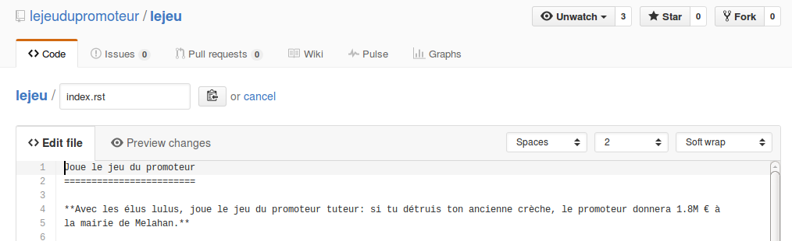

Modifications
-------------

A partir de maintenant tu es connecté(e) à GitHub et tu le restera. Donc tu peux oublier l'étape précédente.

(1) Se promener sur le site
'''''''''''''''''''''''''''

Tu peux à partir de mainenant naviguer normalement sur le site web, comme avant.
Par contre quand tu trouveras une erreur ou voudras proposer une autre solution,
ou n'importe quelle modification ca sera facile gràce à un bouton de modification.

(2) Proposer une modification
'''''''''''''''''''''''''''''

Pour proposer la modification d'une page il suffit de cliquer sur le bouton de modification |Pencil|
en haut à droite. Le "texte source" de la page s'ouvrira **dans une nouvelle fenêtre** ou onglet "GitHub".

.. ..

    Le résultat devrait ressembler à cela :

    ..  figure:: images/GitHubSource.png
        :align: center

        Fenêtre de contrôle GitHub pour à la page à modifier.

    ..  note::

        L'icone en haut à droite montre que tu es connecté(e) à GitHub. Sinon c'est qu'il y a eu une
        erreur dans l'étape de connexion. contacte nous.

    **La seule chose importante pour toi dans cette page** est le petit crayon |Pencil| à droite,
    juste après``Raw | Blame | History``.

Ce petit crayon te menera à un éditeur comme ci-dessous:

    Editeur contenant le "texte source" de la page à modifier.

Grâce à l'éditeur tu peux modifier le texte de la page. Ne t'inquiête pas de la mise en forme.
Un autre contribuable s'en chargera.

Une fois tes modifications faites, il suffit de cliquer sur le bouton "Commit changes"
en bas de la page, ou "Cancel" si tu ne veux pas sauvegarder tes modifications.

Une fois que ta modification est faite, ferme la fenêtre "GitHub". Tu reveras la page
originale. Celle-ci n'est pas modifiée en direct. Tes modifications seront revues et si tout
va bien elle seront mise à jour lors lors de la prochaine mise à jour du site.

Si tu as un soucis n'hesite pas à nous contacter.

Amuse toi bien !

..  |Pencil| raw:: html

    <svg    aria-hidden="true"
            class="octicon octicon-pencil" height="16" version="1.1"
            viewBox="0 0 14 16" width="14">
        <path d="M0 12v3h3l8-8-3-3L0 12z m3 2H1V12h1v1h1v1z m10.3-9.3l-1.3 1.3-3-3 1.3-1.3c0.39-0.39 1.02-0.39 1.41 0l1.59 1.59c0.39 0.39 0.39 1.02 0 1.41z">
        </path>
    </svg>